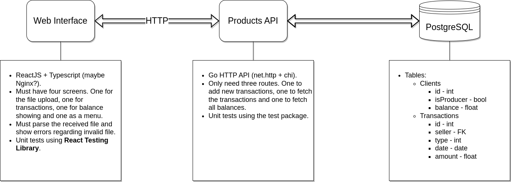

# Desafio Programação Fullstack 1.2.0 - Guilherme Diniz

Hello, I'm Guilherme Diniz and this is my solution to the fullstack programming
challenge for Hubla.

The main concept of the challenge was to develop an application to upload files
that describe multiple financial transactions. Those transactions should be
stored in a relational database. More details on the challenge can be read in
the [instructions file](instructions.md).

## Table of Content

1. [Overall Solution](#overall-solution)
2. [How To Run It](#how-to-run-it)
3. [Front End Details](#front-end-details)
4. [Back End Details](#back-end-details)
5. [Presentation Video](#video)

---

<div id='overall-solution'></div>

## Overall Solution

To solve this challenge, I sketched the following three services solution:



A web interface built with ReactJS (the applications entrypoint) communicates
with a Go API via HTTP, which is connected to a Postgres server.

Each of the three services runs in a different container created by the Docker
runtime.

---

<div id='how-to-run-it'></div>

## How to run it

As the whole solution was built using Docker Compose (a Docker tool to run multi
container applications in development environment), it is really simple to run
it.  
First, is necessary to create a `.env` file in root directory of this project
(the same as this file). This file will contain all the necessary environment
variables so that our application can run. There is a
[.env.example](./.env.example) file with the exact format that the `.env` must
have also in this directory.

After the `.env` is created, the following command will start the three services
at once (run in in your terminal in the root directory of this project):

```sh
docker compose up -d
```

After this, the application will be available in the port 80 of your localhost.
As this port is the default HTTP port, all it is necessary to access the UI is
to type `localhost` in your browser.

The following command will stop all three services (run in in your terminal in
the root directory of this project):

```sh
docker compose down
```

---

<div id='back-end-details'></div>

## Back End Details

The back end solution is composed by a Golang Web API (to connect the database
to other services) and a Postgres server as database.

### Golang Web API

The Golang Web API is built using mainly Go's standard library and a free open
source third party package called [chi](https://go-chi.io/). `chi` offers a
lightweight router that integrates easily to Go's
[http](https://pkg.go.dev/net/http) package.

The service's main type is named `Api`. It holds an instance of the `chi`
multiplexers and an instance of the `Models` struct.

### Postgres Server

The Postgres service is a simple instance of the `postgres:alpine` image, which
is a small Linux distro with all the necessary requirements to run a Postgres
server.

### Models

I decided that only two tables were sufficient to compose my solution.

The **transactions** table holds the information of all the transactions
uploaded and the **clients** table holds the information of each seller.

They have the following format:

Transactions:

| Name    |     Type     |      Obs |
| ------- | :----------: | -------: |
| id      |     int      |       PK |
| type    | varchar(255) | NOT NULL |
| seller  | varchar(255) | NOT NULL |
| date    |  timestamp   | NOT NULL |
| product | varchar(255) | NOT NULL |
| value   |    double    | NOT NULL |

Clients:

| Name        |     Type     |      Obs |
| ----------- | :----------: | -------: |
| id          |     int      |       PK |
| name        | varchar(255) |   UNIQUE |
| balance     |    double    | NOT NULL |
| is_producer |     bool     |    false |

### Routes

The API has only three routes. They all return a standard JSON object (except
for the `/ping` route, which is for simple tests) with a `data` object (which
can be of different types) and a `errorText` (a string with an error message, if
necessary).

The routes are listed below:

- `/ping`:

  - **GET**: simple test route that returns "Pong" as text.

- `/transactions`

  - **GET**: returns all transactions as an array.
    - No query or path parameters are necessary.
    - `data` return format: `Transaction[]`.
  - **POST**: saves a list of transactions and process them, saving the new
    clients and updating their balances as necessary.
    - It expects a JSON array of `Transactions` as body.
    - `data` return format: `Transaction[]`.

- `/balances`
  - **GET**: returns all balances as an array.
    - No query or path parameters are necessary.
    - - `data` return format: `Clients[]`.

---

<div id='front-end-details'></div>

## Front End Details

The front end service is a HTML application built with ReactJS. My original idea
were to serve the built files in a Nginx server, but I decided that is was not
necessary (it is possible to run it as an Nginx server though, but it is
necessary to remove the `target: dev` line from the compose file). The front end
is served then using the React development server.

Is has only 4 screens.

The **Menu** is only used to navigate to the others screens, the **Upload** is
used to choose the input file with new transactions and upload it, the
**Transactions** shows all the transactions saved until that moment and the
**Balances** shows all the clients balances from the saved transactions.

<div id='overall-solution'></div>

## Presentation Video

[Click here to watch it!](https://drive.google.com/file/d/14SMgVQON6BUW_BWd4GwSHxB8tGUTeT5U/view?usp=share_link)